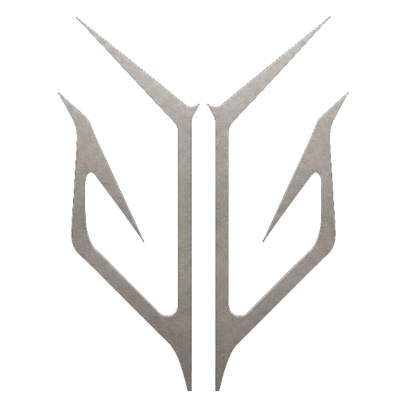
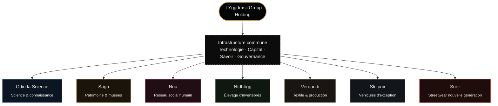

<div align="center">



# Yggdrasil Group

### *Nous ne construisons pas des entreprises. Nous construisons des écosystèmes.*

**Many roots. One ecosystem.**

</div>

---

## Sommaire

- [À propos](#à-propos)
- [L'architecture](#larchitecture)
- [Les 7 entités](#les-7-entités)
- [Structure du dépôt](#structure-du-dépôt)
- [Technologies](#technologies)
- [Consulter le site en local](#consulter-le-site-en-local)
- [Charte graphique](#charte-graphique)
- [Contact](#contact)

---

## À propos

**Yggdrasil Group** (Yggdrasil Groupe) est une **holding** qui fournit une infrastructure commune — technologie, capital, savoir, gouvernance — à un ensemble d'entités souveraines. Chaque entité pousse librement sur ce socle, à son propre rythme, avec sa propre identité, sa propre mission et sa propre esthétique.

L'image directrice du projet est l'arbre-monde de la mythologie nordique : un tronc (la holding), des racines profondes (l'infrastructure partagée) et des branches (les entités) qui grandissent chacune vers leur propre lumière.

> « Nous imaginons des entreprises capables d'évoluer librement tout en partageant une architecture commune. »

Ce dépôt contient le site vitrine du groupe (page holding + page « Racines ») ainsi qu'une page de présentation dédiée à chacune des 7 entités.

## L'architecture

| | |
|---|---|
| **7** | Entités actives |
| **1** | Socle technologique commun |
| **∞** | Horizon |

La holding ne dirige pas les entités au quotidien : elle met à disposition l'infrastructure (technologie, capital, savoir, gouvernance) sur laquelle chaque entité conserve son autonomie et son identité propre.



*Chaque entité pousse sur le même tronc (capital, technologie, savoir, gouvernance) mais reste souveraine sur son identité, son produit et son rythme.*

## Les 7 entités

| # | Entité | Domaine | Mission |
|---|--------|---------|---------|
| 01 | **[Odin la Science](Entite%20Odin.dc.html)** | Science & connaissance | Rendre la recherche instrumentable par tous ceux qui la font. |
| 02 | **[Saga](Entite%20Saga.dc.html)** | Patrimoine & musées | Ce qui est transmis ne meurt pas. |
| 03 | **[Nua](Entite%20Nua.dc.html)** | Réseau social humain | Rendre le lien plus fort que la mesure. |
| 04 | **[Nídhögg](Entite%20Nidhogg.dc.html)** | Élevage d'invertébrés | Faire du vivant discret une filière rigoureuse. |
| 05 | **[Verdandi](Entite%20Verdandi.dc.html)** | Textile & production | Remettre le fil entre les mains de celui qui dessine. |
| 06 | **[Sleipnir](Entite%20Sleipnir.dc.html)** | Véhicules d'exception | La mécanique comme objet de collection. |
| 07 | **[Surtr](Entite%20Surtr.dc.html)** | Streetwear nouvelle génération | Habiller une génération qui ne demande pas la permission. |

<details>
<summary><strong>Détail de chaque entité</strong></summary>

### 01 — Odin la Science
Infrastructure numérique dédiée à la science, à la connaissance et aux outils de recherche. Deux pôles : **Munin Atlas**, base de savoirs scientifiques (données, publications, analyses), et **Hugin Lab**, outil de gestion de laboratoire (modules scientifiques, planification, suivi des équipements).

### 02 — Saga
Préserve, organise et transmet le patrimoine culturel, historique et muséal. Trois volets : cartes & fonds anciens, manuscrits & publications, objets & artefacts — au service des institutions comme du public.

### 03 — Nua
Réseau social centré sur l'humain plutôt que sur la compétition algorithmique : authenticité, échanges, communautés, relations, dans des espaces à taille humaine.

### 04 — Nídhögg
Élevage et vente d'insectes et de cloportes. Professionnalise une filière encore largement informelle : souches suivies, conditions d'élevage documentées, expédition maîtrisée.

### 05 — Verdandi
Plateforme reliant créateurs, clients et usines textiles : création de patrons, chiffrage, mise en production et suivi jusqu'à la livraison.

### 06 — Sleipnir
Sélection et vente de véhicules d'exception. Peu de véhicules retenus, mais un historique et une provenance entièrement documentés, avec accompagnement de bout en bout.

### 07 — Surtr
Marque de streetwear nouvelle génération : coupes travaillées, broderies, matières en mouvement, séries courtes assumées — noir et rouge comme signature.

</details>

## Structure du dépôt

Le dépôt contient **deux implémentations indépendantes** du même site : la version statique `.dc.html` d'origine, et une reconstruction React/TSX plus récente.

```
yggdrasil/
├── Yggdrasil Group.dc.html      # Page vitrine de la holding (FR)      ─┐
├── Yggdrasil Racines.dc.html    # Parcours immersif « Roots » (EN)      │
├── Entite Odin.dc.html          # Fiche entité — Odin la Science        │  implémentation
├── Entite Saga.dc.html          # Fiche entité — Saga                   │  statique
├── Entite Nua.dc.html           # Fiche entité — Nua                    │  (.dc.html)
├── Entite Nidhogg.dc.html       # Fiche entité — Nídhögg                │
├── Entite Verdandi.dc.html      # Fiche entité — Verdandi               │
├── Entite Sleipnir.dc.html      # Fiche entité — Sleipnir               │
├── Entite Surtr.dc.html         # Fiche entité — Surtr                  │
├── support.js                   # Runtime (dc-runtime) des .dc.html    ─┘
│
├── react-app/                   # Reconstruction React/TSX (Vite)      ─┐
│   ├── src/pages/                #  Home, About, Vision, Contact,       │  implémentation
│   │                              #  Legal, Privacy                     │  React/TSX
│   ├── src/components/           #  HomeNav, SubNav, Footer, Reveal,    │
│   │                              #  TiltCard, LegalSidebar             │
│   └── src/assets/images/        #  Visuels dédiés à cette version     ─┘
│
├── assets/                      # Logos, emblèmes, visuels, modèle 3D (yggdrasil.glb)
└── uploads/                     # Sources brutes des visuels
```

## Technologies

**Implémentation statique (racine du dépôt)**
- **Format `.dc.html`** — chaque page est un composant autonome (balise `<x-dc>`) exécuté par un petit runtime React embarqué ([`support.js`](support.js), généré depuis `dc-runtime/src/*.ts`).
- **Three.js** (`GLTFLoader`) — rendu 3D interactif de l'emblème Yggdrasil (`assets/yggdrasil.glb`) sur les pages principales.
- **Canvas 2D** — champs de particules animés (constellations, racines, réseau) réagissant au scroll et au curseur.
- **Google Fonts** — *Jost* (UI) et *Cormorant Garamond* (citations, accents éditoriaux).
- Aucune dépendance de build côté page : chaque fichier `.dc.html` est directement servable tel quel.

**Implémentation React/TSX (`react-app/`)**
- **Vite + React 19 + TypeScript**, routage via `react-router-dom`.
- **Bricolage Grotesque**, **Manrope** et **JetBrains Mono** (Google Fonts).
- Composants réutilisables (`Reveal`, `TiltCard`) pour les animations au scroll et l'effet de parallaxe des cartes.

## Consulter le site en local

**Version statique** — les pages utilisent des modules ES et chargent des assets (police, modèle 3D) en `fetch` : ouvrez-les via un petit serveur local plutôt qu'en double-clic (`file://`) pour éviter les restrictions CORS/module.

```bash
# depuis la racine du dépôt
npx serve .
# puis ouvrir http://localhost:3000/Yggdrasil%20Group.dc.html
```

**Version React/TSX**

```bash
cd react-app
npm install
npm run dev
# puis ouvrir http://localhost:5173
```

## Charte graphique

| Rôle | Couleur |
|---|---|
| Fond | `#050506` / `#030304` |
| Texte | `#EDEAE4` |
| Accent — Holding | `#C6A25C` (or) |
| Odin | `#89A7D6` (bleu) |
| Nua | `#E86A8A` (rose) |
| Nídhögg | `#7FA07A` (vert) |
| Verdandi | `#C8B9A6` (taupe) |
| Sleipnir | `#B9C0C7` (argent) |
| Surtr | `#C8443A` (rouge) |

## Contact

📍 1 place du Nord, 75000 Paris, France
✉️ [contact@yggdrasil-groupe.com](mailto:contact@yggdrasil-groupe.com)

---

<div align="center">

© 2026 Yggdrasil Group — *Everything begins beneath the surface.*

</div>
